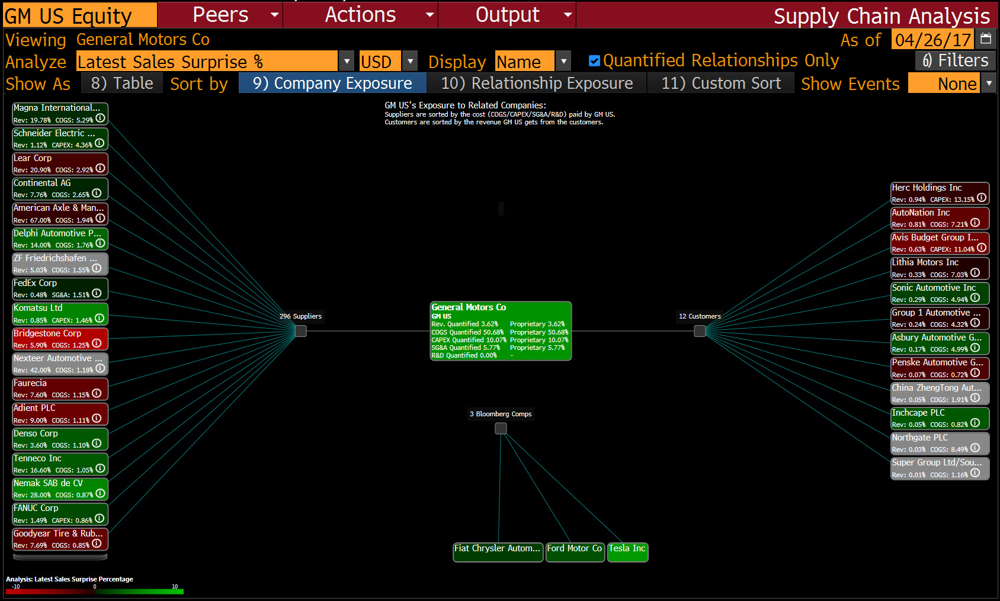
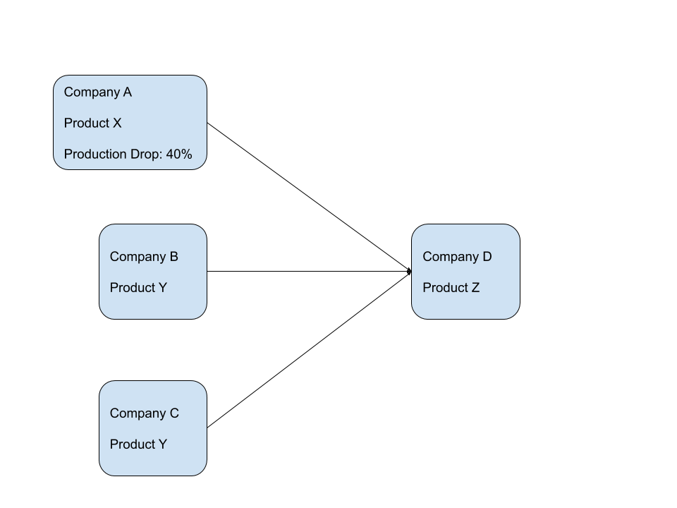
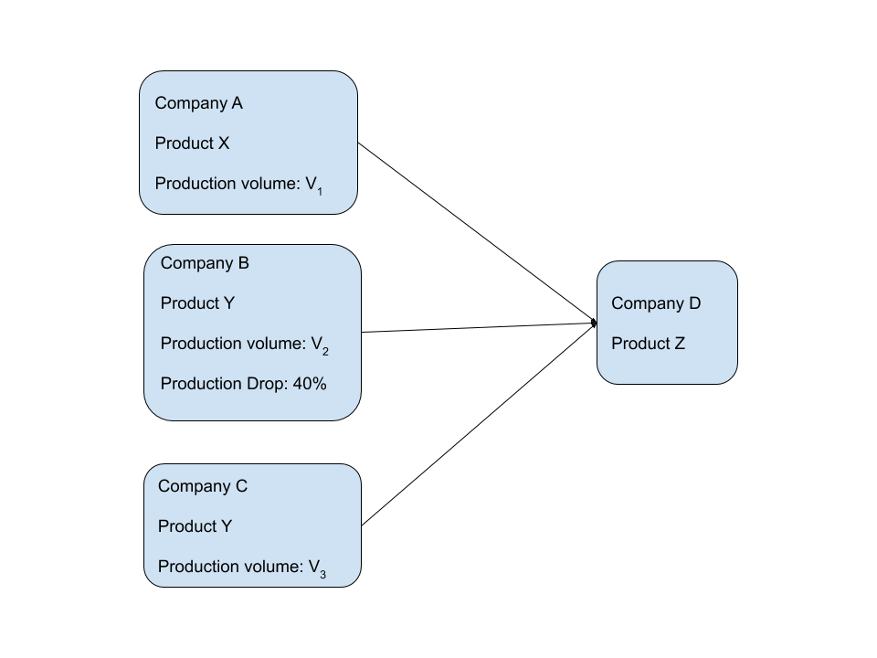
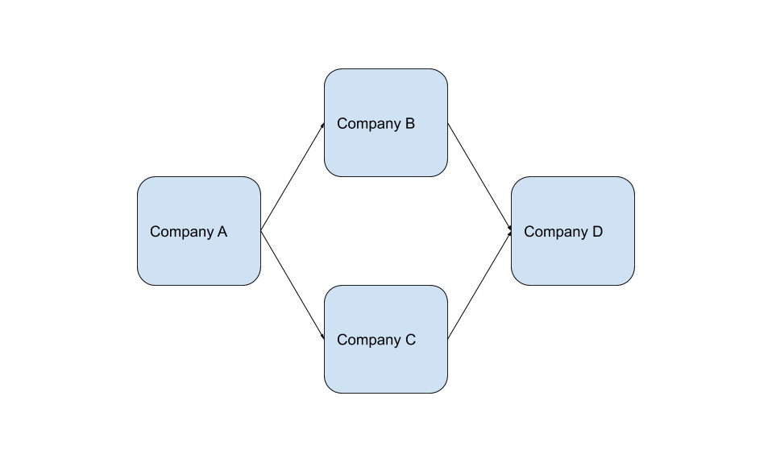
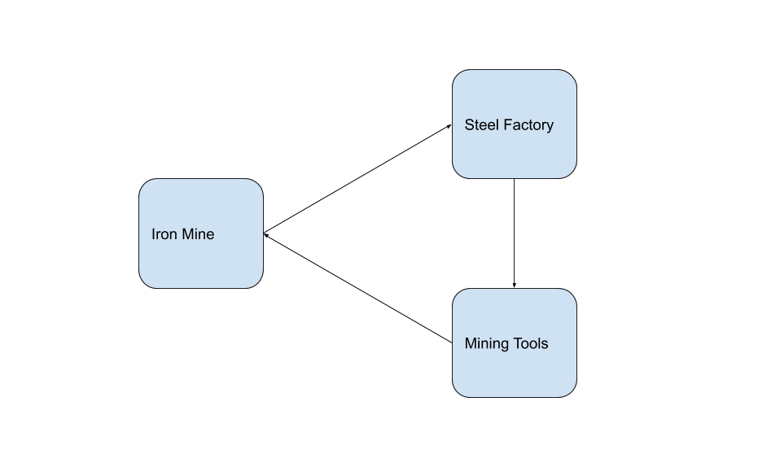

# Supply Chain Analysis

## Author
* Farhang Rouhi

## Introduction
During the Covid-19 pandemic, disruption in supply chains has been one of the strongest forces affecting the markets.
Analyzing supply chain data can be very useful for traders and investors in times like this when supply chains are being disrupted.
Supply chain analysis can also be useful for risk management when preparing for events like this, or even for making decisions in normal markets to gain a competitive advantage.
Bloomberg offers one of the most complete supply chain datasets. The Bloomberg supply chain data is available through the SPLC\<GO> command in bloomberg terminal, and more details 
is available through the maps commands.

The SPLC\<GO> command, gives the suppliers and costumers of a company.
Using this data, we can determine how a disruption in one of the suppliers or costumers of a company can affect that company.
In reality, the affect of such a disruption can be much more complicated, and a more complete analysis needs many layers of complexity.
For example, a disruption in one company can cause a disruption in its costumer, and this new disruption can cause another disruption in the costumer
of the costumer of the first company. In other words, a disruption in one company can eventually lead to disruptions in a company that is not
directly related to the first company. More complexity arises when we consider the market shrinkage caused by supply chain disruptions.

This program creates a model of the supply chain network. Users can apply disruptions in supply chain to this model.
My program analyzes the modified supply chain and makes predictions on how different companies are affected. For example, you might want
to invest in a company that uses oil products as its supply. However, you know that the US is going to pose sanctions on one of the major 
oil producers. You can apply the potential disruption to the current supply chain model, and my algorithm tells you
if the company you are trying to invest in is at risk. In this document, I will provide a quick guide on how to use the program. Then, I will 
talk about data generation. Next, I will discuss how my algorithm works in details. Finally, I will explore future steps.

## Instructions and Available Commands
To use my program, first you need to have some data. Some randomly generated data is already available, but you can also generate other randomly generated data using the data_generator.py (if you want to change some parameters). You also need to make sure the path in disruption_analyzer.py points to your data. Finally, you can run the disruption_analyzer.py and use the following commands:
* remove company [company_name]
* remove relation [supplier_name] [costumer_name]
* reduce production [production_drop_percentage] [company_name]
* reduce relation_capacity [capacity_drop_percentage] [supplier_name] [costumer_name]
* shrink market [market_shrinkage_percentage] [company_name]
* predict [company_name]
* set iteration_limit [iteration_limit]
* set depth_limit [depth_limit]
* set reduction_factor [reduction_factor]
* config
* refresh
* exit
* help

## Data Generation
The most challenging thing about supply chains is that the data is not easily accessible. Bloomberg has done an amazing job collecting the supply chain data.
Bloomberg uses human and computerized methods to aggregate publicly disclosed data. Additionally, Bloomberg uses algorithmic and mathematical
methods to complete this dataset. The Bloomberg supply chain data is available through the SPLC\<GO> command in bloomberg terminal, and more details 
are available through the maps commands. The output of SPLC\<GO> command looks as follows:

[Credit: https://www.bloomberg.com/professional/blog/seen-60-minutes/]

I did not have access to this data, so I created a random json file by writing data_generator.py. This code generates random data that is close in its organization to the
output of the SPLC command. One very important thing to note is that my code is based on the assumption that each company has only one product. This assumption is not tru in reality,
but we can split the company into smaller ones in our data and then use the code, and at the end merge them together.

## Algorithm and Detailed Description
In previous section, I explained the format of the data. The main program reads in this JSON file and converts it to a directed graph.
Each node represents a company and contains all of its metadata. Each node has pointers to the costumers of the company it represents.
For example, lets assume company B in our raw data has company A as one of its suppliers and company C as one of its costumers.
The corresponding graph is as follows:

As you can see, node A points to node B, meaning that company B is a costumer of A. Similarly, there is an edge from B to C which means that C is a costumer of B.

After generating the graph, my program listens for user commands, and executes the relevant operations. User can apply any supply chain disruptions to the model using available commands
such as "remove company", "remove relation", "reduce production", and "shrink market". These commands apply the requested changes to the graph by updating one or two nodes in the graph.
Next, the programs runs two modified BFS algorithms to predict how other parts of the graph will be affected and how other companies and their relations will be disrupted. The predicted disruptions and the updated metadata are stored in the nodes. This process can continue as many times as users want. Finally, users can ask for the predicted disruptions in a specific company by
using the "predict [company]" command. This command prints the predicted disruptions that are stored in a node."

At this point, we have explored the general idea behind this program. The most important and the most complicated part of this program is the algorithm that gets a disrupted node, and updates other nodes based on this disruption. To do this we need to explore the nodes that are affected by the disruption, so BFS and DFS are our best candidates.
Among these two options, BFS is a better candidate. The reason is that we want the disruption in one company to reach and affect it's direct costumers before affecting its indirect costumers (costumers of its costumers), and BFS explores all of the children of a node before moving on to its grand children. DFS does not offer this property. Having this property is important because this property is closer to reality, and since visiting a node and a cycle multiple times is allowed in this algorithm (up to a limit), the results can be slightly different.

So far, we saw that each node is visited using a BFS algorithm. Now, we should explore how each node is modified when they are visited. The easiest case is if the node has only one supplier that has been affected. in this case, the production of the node is equally dropped. Lets look at the following example:

In this example we are exploring node B. Since production of its supplier, node A, is dropped by 40%, the production of B will also drop by 40% since it has 40% less supply to work with.
What if the company had more that one suppliers? If the product of its supplier is unique and no other supplier is providing it, the situation is very similar:

In this example, we are updating node D. Production of node A has dropped by 40% and it is the only supplier of D that offers product X. Because it is the only one that supplies X, a 40% drop in its production leads to a 40% drop in the production of D. Now, lets look at a more complicated situation where the affected supplier does not offer a unique product:

In this example, we are updating node D. Production of node B has dropped by 40%, but it offers product Y which is also offered by C. It is clear that the production of D will not drop by 40% since C is also offering the same product. In fact, even if B stops its production, since C is providing the same product, D will not halt its production. This case is very common in reality and companies have multiple suppliers for the same supply for many reasons. In this situations, we need to know how much products each supplier is providing to the company. This data is very difficult to find, so we need a good approximation. There are two possible approximations, each with a major flaw:
1. production volume: Using production volume of a supplier as an approximation for the amount of products that supplier provides the company is the best method. The only problem with this method is that the company might for example have an exclusive deal with a smaller company and buy more supplies from it compared to a bigger company, and this approximation cannot reflect that.
2. Average supply volume (production volume/number of costumers): This is another approximation method (uncomment to use in my code). This method fixes the problem we mentioned in previous method, but it poses another problem. Many small companies try claim to be connected to bigger companies to get more publicity. This can make the averages very inaccurate.

Using the selected approximation, and the production drop of each supplier, we can find the amount of supply before and after disruption. Summing these values for suppliers with the same product, allows us to think of them as one bigger supplier and apply our previous methods. Note that the production drop of a node will change only if the newly calculated drop is bigger.

### Revisiting a Node and Handling Cycles
In normal BFS, we want to visit each node only once, so we do not revisit nodes. In this problem, we have to allow revisiting of nodes for accurate results. To demonstrate, lets look at the following example:

In this example, if we start from A, we will reach both B and C. Both B and C can affect D, and therefore, we need to visit D twice. As you can see, revisiting a node needs to be allowed for accurate results.
If we allow revisiting a node, how do we handle cycles? First thing to note is that sometimes, we want to go through a cycle multiple times. To demonstrate, let's look at an example:

A decrease in mining leads to less steel production, which leads to less mining tools, which in turn leads to less mining, and the cycle continues. So, we might want to continue the cycle for multiple iterations. There is an iteration limit in the code that can be set by the user to limit the number of iterations, since in reality this affect might not continue for many iterations or it might take too much time to reach that level.

### Diminishing Effect
Everything we discussed so far assumes that a disruption in one company immediately leads to a disruption in the next one. This is not completely accurate and this process takes time. For example, companies usually have supplies and products in their storage, and it can take a while until they are actually affected by any disruption. Therefore, in my code we can limit the depth we want to visit, and we can pose a reduction factor to reduce the predicted affect in each iteration.

### Market Shrinkage
We can look even deeper into this problem. If we predict that the production of a company will drop by a certain percentage, the company will need less supplies from all of its suppliers.
Therefore, the market of the supplier will shrink. Lets look at graph 3 again:

The production of D will drop by 40% due to the production drop in A. This means that A now needs 40% less supplies of all kinds. Therefore, the market for Y will shrink and B and C will be effected. This feature is not added to the code yet, but the algorithm is very similar and we basically go backwards in our graphs.

