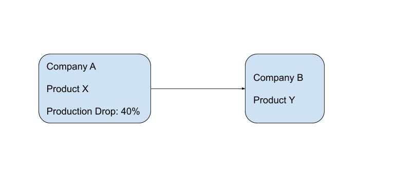

# Supply Chain Analysis
I wrote this program to demonstrate my interest in Bloomberg and Bloomberg tech, and to demonstrate my problem solving skills.
## Author
* Farhang Rouhi
##Introduction
During the Covid-19 pandemic, disruption in supply chains has been one of the strongest forces affecting the markets.
Analyzing supply chain data can be very useful for traders and investors in times like this when supply chains are being disrupted.
Supply chain analysis can also be useful for risk management when preparing for events like this, or even for making decisions in normal markets to gain a competative advantage.
Bloomberg offers one of the most complete supply chain datasets. The Bloomberg supply chain data is available through the SPLC\<GO> command in bloomberg terminal, and more details 
is available through the maps commands.

The SPLC\<GO> command, gives the suppliers and costumers of a company.
Using this data, we can determine how a disruption in one of the suppliers or costumers of a company can affect that company.
In reality, the affect of such a disruption can be much more complicated, and a more complete analysis needs many layers of complexity.
For example, a disruption in one company can cause a disruption in its costumer, and this new disruption can cause another disruption in the costumer
of the costumer of the first company. In other words, a disruption in one company can eventually lead to disruptions in a company that is not
directly related to the first company. More complexity arises when we consider the market shrinkage caused by supply chain disruptions.

This program creates a model of the supply chain network. Users can apply disruptions in supply chain to this model.
My program analyzes the modified supply chain and makes predictions on how different companies are affected. For example, you might want
to invest in a company that uses oil products as its supply. However, you know that the US is going to pose sanctions on one of the major 
oil producers. You can apply the potential disruption to the current supply chain model, and my algorithm tells you
if the company you are trying to invest in is at risk. In this document, I will provide a quick guide on how to use the program. Then, I will 
talk about data generation. Next, I will discuss how my algorithm works in details. Finally, I will explore future steps.

## Instructions and Available Commands

## Data Generation
The most challenging thing about supply chains is that the data is not easily accessible. Bloomberg has done an amazing job collecting the supply chain data.
Bloomberg uses human and computerized methods to aggregate publicly disclosed data. Additionally, Bloomberg uses algorithmic and mathematical
methods to complete this dataset. The Bloomberg supply chain data is available through the SPLC\<GO> command in bloomberg terminal, and more details 
is available through the maps commands.

note: should merge same companies to get results (we split them based on product)

## Algorithm and Detailed Description
In previous section, I explained the format of the data. The main program reads in this JSON file and converts it to a directed graph.
Each node represents a company and contains all of its metadata. Each node has pointers to the costumers of the company it represents.
For example, lets assume company B in our raw data has company A as one of its suppliers and company C as one of its costumers.
The corresponding graph is as follows:

As you can see, node A points to node B, meaning that company B is a costumer of A. Similarly, there is an edge from B to C which means that C is a costumer of B.

After generating the graph, my program listens for user commands, and executes the relevant operations. User can apply any supply chain disruptions to the model using available commands
such as "remove company", "remove relation", "reduce production", and "shrink market". These commands apply the requested changes to the graph by updating one or two nodes in the graph.
Next, the programs runs two modified BFS algorihtms to predict how other parts of the graph will be affected and how other companies and their relations will be disrupted. The predicted disruptions and the updated metadata are stored in the nodes. This process can continue as many times as users want. Finally, users can ask for the predicted disruptions in a specific company by
using the "predict [company]" command. This command prints the predicted disruptions that are stored in a node."

At this point, we have explored the general idea behind this program. The most important and the most complicated part of this program is the algorithm that gets a disrupted node, and updates other nodes based on this disruption. To do this we need to explore the nodes that are affected by the disruption, so BFS and DFS are our best candidates.
Among these two options, BFS is a better candidate. The reason is that we want the disruption in one company to reach and affect it's direct costumers before affecting its indirect costumers (costumers of its costumers), and BFS explores all of the children of a node before moving on to its igrand children. DFS does not offer this property. Having this property is important because this property is closer to reality, and since visiting a node and a cycle multiple times is allowed in this algorithm (up to a limit), the results can be slightly different.

So far, we saw that each node is visited using a BFS algorithm. Now, we should explore how each node is modified when they are visited. The reasiest case is if the node has only one supplier that has been affected. in this case, the production of the node is equally dropped. Lets look at the following example:

### General Algorithm

### Handling Cycles

### Diminishing Effect

